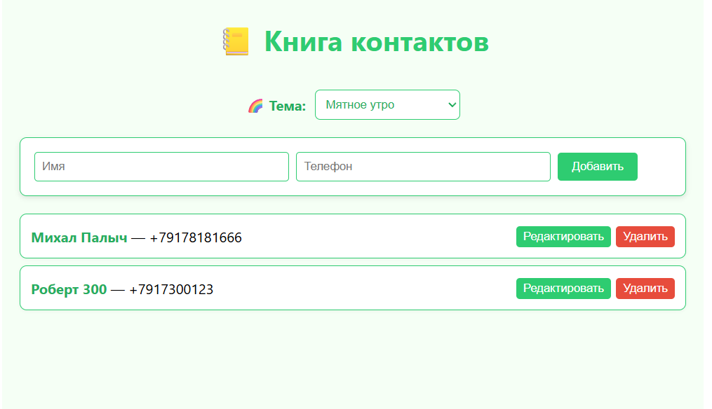
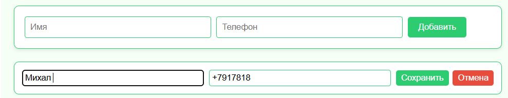

# Книга контактов — КР №4

React-приложение для управления контактами с поддержкой описаний и 5 нежных цветовых тем.

## Функции:

- Добавление контакта: имя, телефон
- Удаление контактов
- Редактирование контактов (имя и телефон)
- Переключение между 5 цветовыми темами:
  - Утренний туман
  - Лавандовый закат
  - Морская пена
  - Персиковый рассвет
  - Мятное утро

---

## Скриншоты

### 1. Главная страница приложения



> *На скриншоте показано добавление нового контакта и отображение списка существующих.*

---

### 2. Режим редактирования контакта



> *На скриншоте показано, как пользователь редактирует имя и телефон контакта в режиме "Редактировать".*

---

## Вывод

В ходе выполнения контрольной работы №4 было разработано полноценное клиентское веб-приложение «Книга контактов» на основе библиотеки React. Приложение реализует все требования задания: добавление контакта (имя и телефон), отображение и удаление записей, а также **расширенный функционал — редактирование контакта**, что значительно улучшает пользовательский опыт.

Разработка выполнена с использованием современных подходов индустриального программирования:
- компонентная архитектура (разделение логики и представления),
- управление состоянием через хук `useState`,
- обработка событий и пользовательского ввода,
- работа с локальными данными без внешних зависимостей.

Приложение корректно запускается, не содержит ошибок в работе и сопровождается подробным README.md с инструкцией по запуску, скриншотами и описанием функционала. Исходный код размещён в публичном репозитории на GitHub, что соответствует требованиям задания.

Таким образом, работа подтверждает освоение ключевых навыков разработки интерактивных веб-приложений с использованием React и демонстрирует способность проектировать, реализовывать и документировать программное решение в соответствии с принципами индустриального программирования.

---

## Запуск

```bash
npm install
npm start
