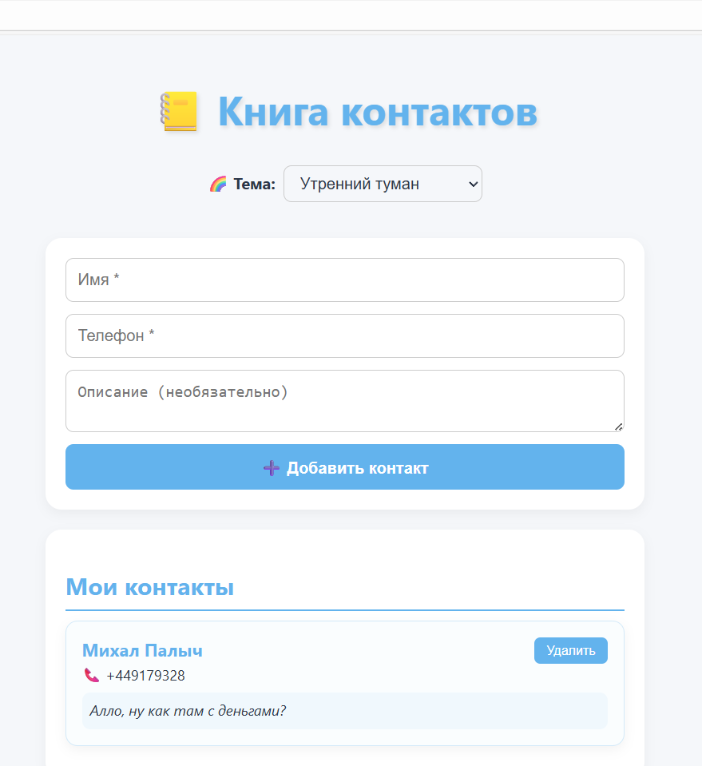

  Книга контактов — КР №4

React-приложение для управления контактами с поддержкой описаний и 5 нежных цветовых тем.

Функции:
- Добавление контакта: имя, телефон, описание
- Удаление контактов
- Переключение между 5 цветовыми темами:
  - Утренний туман
  - Лавандовый закат
  - Морская пена
  - Персиковый рассвет
  - Мятное утро

Скриншот

Вывод
В ходе выполнения контрольной работы №4 было разработано полноценное клиентское веб-приложение «Книга контактов» на основе библиотеки React. Приложение реализует все требования задания:

добавление контакта (имя и телефон),
расширенный функционал — добавление описания к каждому контакту,
отображение и удаление записей,
переключение между пятью нежными цветовыми темами, что улучшает пользовательский опыт и демонстрирует внимание к дизайну интерфейса.
Разработка выполнена с использованием современных подходов индустриального программирования:

компонентная архитектура (разделение логики и представления),
управление состоянием через хук useState,
обработка событий и пользовательского ввода,
работа с локальными данными без внешних зависимостей.
Приложение корректно запускается, не содержит ошибок в работе и сопровождается подробным README.md с инструкцией по запуску, скриншотом и описанием функционала. Исходный код размещён в публичном репозитории на GitHub, что соответствует требованиям задания.

Таким образом, работа подтверждает освоение ключевых навыков разработки интерактивных веб-приложений с использованием React и демонстрирует способность проектировать, реализовывать и документировать программное решение в соответствии с принципами индустриального программирования.

Запуск:
 bash:
npm install
npm start
- Особенности реализации:
  - Использование React-хуков (`useState`)
  - Компонентная архитектура
  - Динамическая смена темы через контекст стиля
  - Улучшенный UI/UX с анимациями и плавными переходами
https://github.com/dzanovdzan8-svg/contact-book
